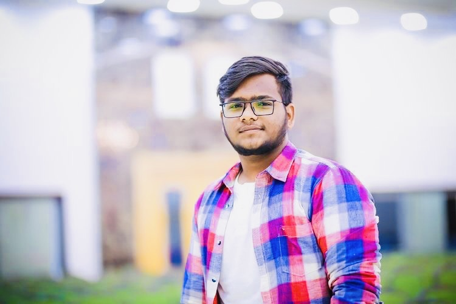

# YASWANTH KANAKALA

An aspiring young Indian, strongly determined Learner pursuing Masters in Applied Cumputer Science from Northwest Missouri State Univeristy.I've secure some strong research and information retrieval skills, honed through extensive academic projects and workshops.Organized a national level technical Symposium - ITYUKTA 2K22 at Jawaharlal Nehru Technological University Vizianagaram which includes two workshops, Machine Learning and App development with IOT. I also ensure that I'm an individual with strong academic and communication skills, demonstrated through presentation, group projects, interaction with peers and faculty. My love towards badminton never ends which helped me many tournaments and medals. And, I'm more into charity and strongly belive that **Success is not the key to Happiness but happiness is the key to Success.**

